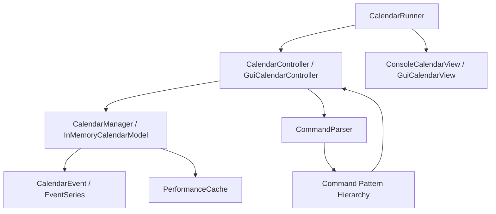

# Multi-Calendar Event Management System

An extensible, cross-platform calendar and schedule management system built in Java using modern **Model-View-Controller (MVC)** and **Command** design patterns. It supports multi-calendar management with automatic timezone conversions, recurring event series, flexible edit/delete scopes, iCalendar (.ics/.ical) and CSV export, and three distinct execution modes: **Graphical User Interface (Swing GUI)**, **Interactive CLI**, and **Headless Script Execution**.

---

## Key Features

-  **Multi-Calendar & Timezone Conversion**: Manage multiple calendars simultaneously with distinct timezones. Events automatically convert times when copied across timezones.
-  **Flexible Recurring Event Series**: Schedule single, all-day, and repeating events (specified by days of the week, occurrence limits, or end dates).
-  **Fine-Grained Edit & Delete Scopes**:
  - *This event only* (single occurrence)
  - *This and future events* (forward-propagating series update)
  - *All events in series* (entire recurring series)
-  **High-Performance LRU Caching**: In-memory caching for sub-millisecond date queries and conflict detection.
-  **Standard iCalendar & CSV Export**: Export schedules to `.ics` / `.ical` (RFC 5545 compatible) and tabular `.csv` formats.
-  **Three Execution Interfaces**:
  - **Swing GUI**: Clean, interactive desktop experience.
  - **Interactive CLI**: Real-time terminal command interface.
  - **Headless Mode**: High-speed batch processing from script files.
-  **High Quality & Test Coverage**: 97%+ Line Coverage and 92%+ PIT Mutation Testing score.

---

## GUI Walkthrough & Screenshots

### 1. Main Calendar View & Navigation
Month-view grid with visual indicators for today (blue highlight), selected days (blue outline), and event dates (green dots).

<p align="center">
  
</p>

---

### 2. Creating Events & Recurring Series
Create timed, all-day, or recurring series specifying days of the week (Mon–Sun) and recurrence bounds (number of occurrences or end date).

<p align="center">
  
</p>

---

### 3. Multi-Calendar Switcher & Timezone Management
Create or switch between multiple calendars (e.g., Work, Personal, Travel) with independent timezones.

<p align="center">
  
</p>

---

### 4. Advanced Edit with Scopes
Edit event properties (subject, start/end time, location, description) with scope options matching standard enterprise calendar behavior.

<p align="center">
  
</p>

---

### 5. Cross-Calendar Copy with Automatic Timezone Conversion
Copy single events or date ranges to another calendar with instant timezone recalculation.

<p align="center">
  
</p>

---

## 🚀 Getting Started

### Prerequisites
- **Java Development Kit (JDK)**: Version 11 or higher (JDK 17+ recommended)
- **Gradle**: Included via the `./gradlew` wrapper (no separate Gradle installation needed)

### 🔨 Building the Application

Clone the repository and build the standalone executable JAR:

```bash
# Clone the repository
git clone https://github.com/neerajajoshi/Multi-Calendar-Event-Management-System.git
cd Multi-Calendar-Event-Management-System

# Build the executable JAR (macOS/Linux)
./gradlew jar

# Build the executable JAR (Windows)
.\gradlew.bat jar
```

The compiled JAR will be located at `build/libs/calendar-1.0.jar`.

---

## How to Run

### Mode 1: Graphical User Interface (GUI)
Run without arguments to launch the desktop UI:

```bash
java -jar build/libs/calendar-1.0.jar
```
*(Or on Windows, double-click `build/libs/calendar-1.0.jar`)*

---

### Mode 2: Interactive Terminal CLI
Type commands interactively and see live outputs:

```bash
java -jar build/libs/calendar-1.0.jar --mode interactive
```

**Example interactive session:**
```text
> create calendar --name Work --timezone America/New_York
Calendar 'Work' created with timezone America/New_York
> use calendar --name Work
Now using calendar: Work (timezone: America/New_York)
> create event --subject "Team Standup" --from 2025-06-01T09:00 --to 2025-06-01T09:30
Event created: Team Standup
> print events on 2025-06-01
Events on 2025-06-01:
- Team Standup from 09:00 to 09:30
> exit
```

---

### Mode 3: Headless Script Mode
Execute a batch file of commands automatically:

```bash
java -jar build/libs/calendar-1.0.jar --mode headless res/commands.txt
```

---

## Command Reference

| Action | Command Syntax |
| :--- | :--- |
| **Create Calendar** | `create calendar --name <name> --timezone <zoneId>` |
| **Use Calendar** | `use calendar --name <name>` |
| **Edit Calendar** | `edit calendar --name <oldName> --property name <newName>`<br>`edit calendar --name <name> --property timezone <newZoneId>` |
| **List Calendars** | `list calendars` |
| **Create Timed Event** | `create event --subject "<name>" --from <YYYY-MM-DDTHH:mm> --to <YYYY-MM-DDTHH:mm>` |
| **Create All-Day Event**| `create event --subject "<name>" --on <YYYY-MM-DD>` |
| **Create Recurring Series** | `create event --subject "<name>" --from <YYYY-MM-DDTHH:mm> --to <YYYY-MM-DDTHH:mm> --repeats <MWF> --for <N> times`<br>`create event --subject "<name>" --from <...T...> --to <...T...> --repeats <MWF> --until <YYYY-MM-DD>` |
| **Edit Single Event** | `edit event --subject "<name>" --start <YYYY-MM-DDTHH:mm> --property <subject\|start\|end\|location\|description> <newVal>` |
| **Edit Series Events** | `edit events --subject "<name>" --from <YYYY-MM-DDTHH:mm> --property <prop> <newVal>`<br>`edit series --subject "<name>" --property <prop> <newVal>` |
| **Copy Event** | `copy event --subject "<name>" --start <YYYY-MM-DDTHH:mm> --target <targetCal> --to <YYYY-MM-DDTHH:mm>` |
| **Copy Events on Date**| `copy events on <YYYY-MM-DD> --target <targetCal> --to <YYYY-MM-DD>` |
| **Copy Range** | `copy events from <YYYY-MM-DD> to <YYYY-MM-DD> --target <targetCal> --to <YYYY-MM-DD>` |
| **Check Availability**| `show status on <YYYY-MM-DDTHH:mm>` |
| **Print Events** | `print events on <YYYY-MM-DD>`<br>`print events from <YYYY-MM-DDTHH:mm> to <YYYY-MM-DDTHH:mm>` |
| **Export Calendar** | `export calendar --format csv --file <filename.csv>`<br>`export calendar --format ical --file <filename.ics>` |

---

## Architecture & Design Patterns



- **MVC (Model-View-Controller)**: Strict separation of business rules, UI representations, and coordination flow.
- **Command Pattern**: Encapsulates user actions into reusable command objects (`CreateEventCommand`, `CopyEventCommand`, `EditSeriesCommand`, etc.).
- **Observer / Listener Pattern**: GUI triggers asynchronous updates to model state without tight coupling.
- **Defensive Copying & Immutability**: All date-time objects and event collections protect against external mutation.

---

## Testing & Code Quality

### Running Unit Tests & Jacoco Coverage
```powershell
.\gradlew.bat test
```
Generates HTML test and coverage reports in `build/reports/tests/test/` and `build/reports/jacoco/test/`.

### Running PIT Mutation Testing
```powershell
.\gradlew.bat pitest
```
Reports mutation coverage (mutants killed vs. survived) at:
`build/reports/pitest/index.html`

---

## Repository Structure

```text
├── src/
│   ├── main/java/
│   │   ├── CalendarRunner.java         # Main Application Entry Point
│   │   ├── controller/                 # MVC Controllers & Command Parser
│   │   │   └── commands/               # Command pattern implementations
│   │   ├── model/                      # Calendar Models, Events & Cache
│   │   ├── util/                       # Timezone & Date utility helpers
│   │   └── view/                       # Swing GUI and Console Views
│   └── test/java/                      # Comprehensive Unit & Integration Tests
├── res/                                # Screenshots, command scripts & assets
├── build.gradle                        # Gradle build, Checkstyle, Jacoco & PIT
└── README.md                           # Documentation
```

---

## Authors & Acknowledgments

- **Neeraja Joshi** & **Binary Blossoms Team**
- Northeastern University — CS 5010 Program Design Paradigm
